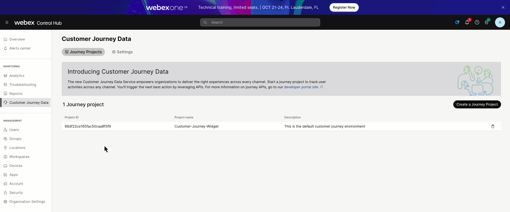
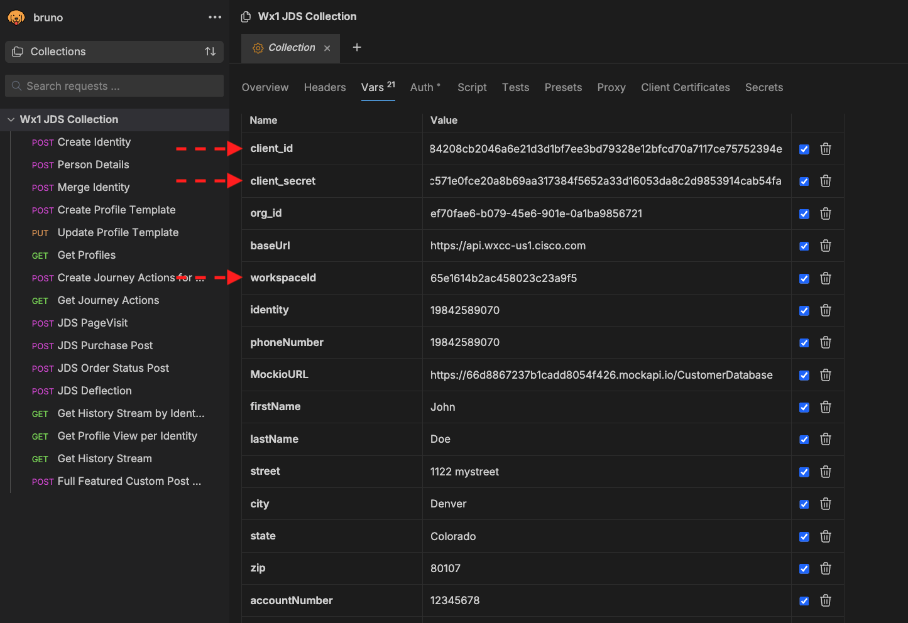
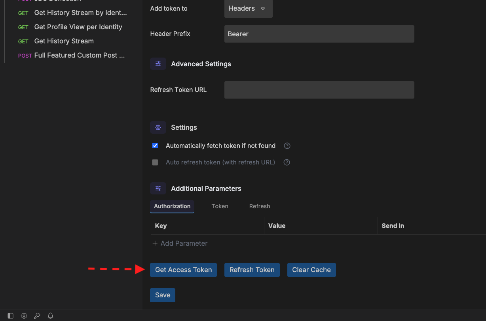
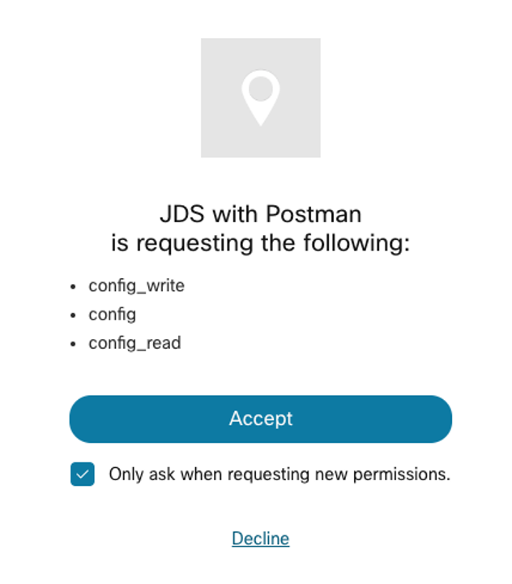
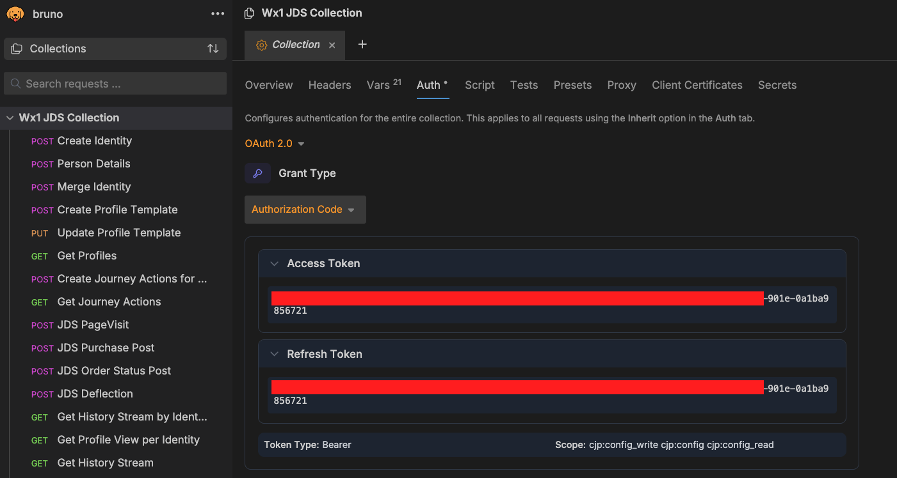
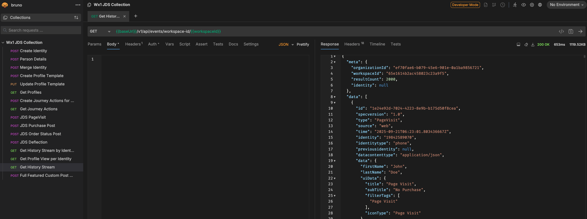
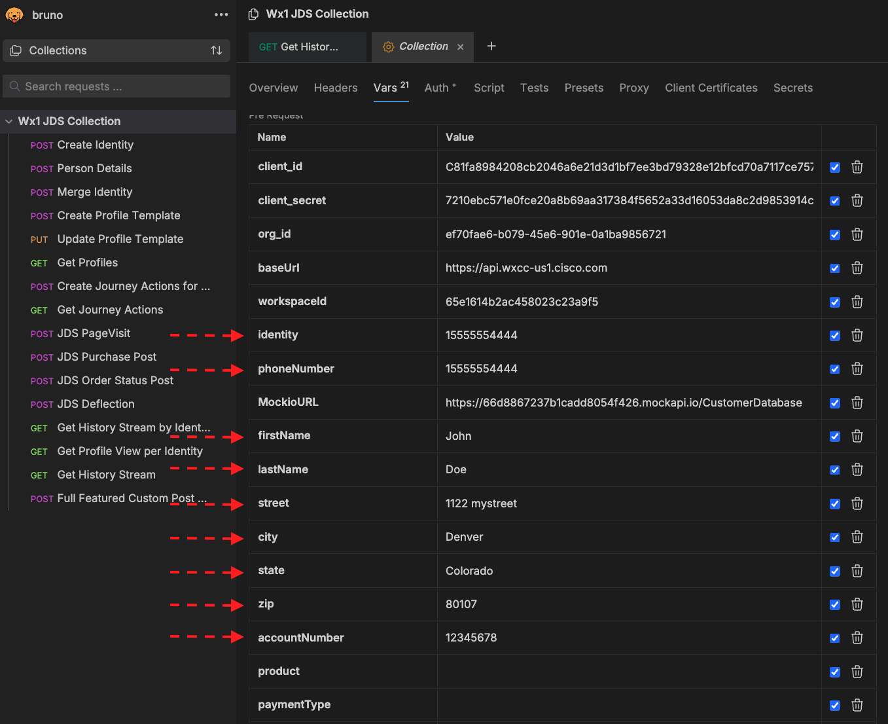
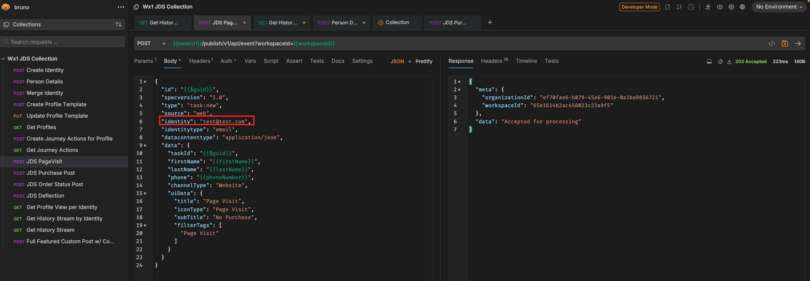
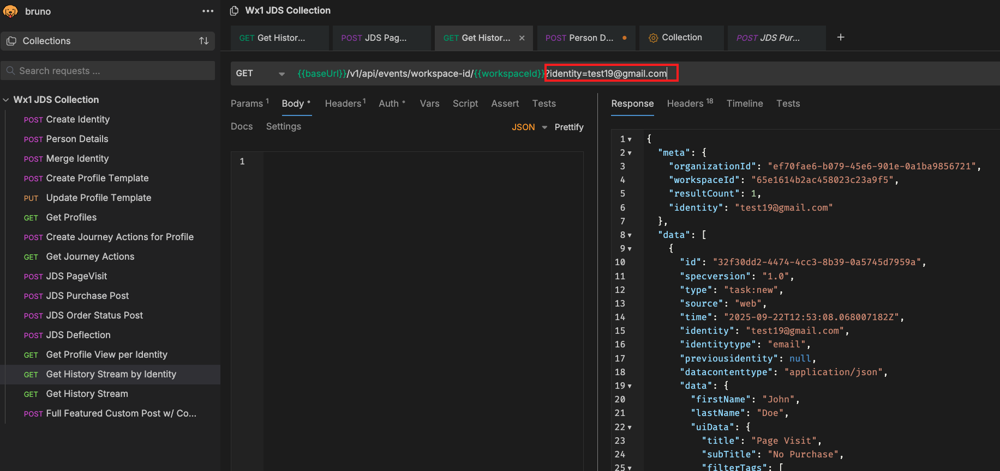

# Lab 1 - Using Bruno/Postman to interact with JDS

???+ warning
    Bruno and Postman clients are already installed in the laptop, do not use any web versions. 

???+ tip "WxCC Connector GIF"
    In this lab tenant, the Webex Contact Center connector for JDS has been enabled. You DO NOT need to do it and your admin account doesn't have access. However, here's a video showing you how to do it for your learning:  
     <figure markdown>
     
     </figure>
        

## Lab 1.1 Create a Webex App Integration
???+ webex "Instructions"

    1. Navigate to the <a href="https://developer.webex-cx.com" target="_blank">Contact Center for Developers</a> website. 
    2. Login via the button on the top right and use your admin credentials. 
    3. Once logged in navigate to “My Webex Apps” under your login avatar at the top right and then select “Create a New App”. 
    4. Create a new App with these parameters:

        - Integration Name : JDS with Bruno
        - Description: JDS with Bruno  
        - Redirect URL(s): https://oauth.pstmn.io/v1/callback
        - Scopes: Check the top three check boxes.
            ```
            -cjp:config
            -cjp:config_write
            -cjp:config_read
            ```
        - Accept the terms check box.
        - Click Add Integration

        ???+ tip "Webex App Integration GIF"
            <figure markdown>
            
            </figure>

    5. Copy and save the Client ID and the Client Secret. 

## Lab 1.2 Configure Postman/Bruno to send APIs to JDS

!!! note
    You can find the full API documentation <a href="https://developer.webex.com/webex-contact-center/docs/api/v1/customer-identification" target="_blank">here</a>

???+ webex "Instructions"
    
    Open Bruno and you should see the collection that was exported during the Getting Started section of the lab. Now let’s change some of the collection settings: 

    1. Click on the collection name "Wx1 JDS Collection" in the left panel and you will see the settings. 

    2. Click on the Variables tab and update the following fields, set the Initial and Current value to the same values described below:

        - client_id – Set this to the Client ID for the Webex App you added earlier.
        - client_secret – Set this to the Client Secret for the Webex App you added earlier.
        - org_id – This is an optional setting. 
        - workspaceId – This is the ID for your lab tenant: **67e2e90ec4b84e752570056c**
        ???+ info "Bruno Authentication Variables IMG"
            <figure markdown>
            
            </figure>

    4. Now click on the Authorization sub tab to the left of the Variables tab and scroll to the bottom of the screen.

    5. Click on the orange “Get New Access Token” button.

        ???+ info "Get New Access Token IMG"
            <figure markdown>
            
            </figure>

    6. A Webex login window will pop up, enter the admin sandbox credentials that you used to create the Webex App integration. 

        ???+ info "Bruno Permission Request IMG"
            <figure markdown>
            { width="300" }
            </figure>
        
    7. Bruno will intercept the bearer Access Token and a Refresh Token from the CallbackURL you setup in the app integration, now you can use the token to send API calls to JDS. Bruno will also manage the Access Token expiration by using the Refresh Token on your behalf.

        ???+ info "Bruno Token IMG"
            

## Lab 1.3 Sending API Calls to CJDS using Bruno
???+ webex "Instructions"

    Let’s test one of the API calls from the Bruno collection to confirm it works.

    1. Under the Wx1 JDS Collection on the left navigation pane, Click the green “GET” named “Get History Stream”. This will open the REST call in a tab on the right, Send the request by clicking the arrow icon and you should see in the response tab recent JDS events.

        ???+ info "GET History IMG"
            <figure markdown>
            
            </figure>

    2. If the previous step is successful, it confirms that the Bruno app is correctly configured to interact with CDJS. Now, let's update other variables in the Wx1 JDS Collection: 

        - The variables firstName, lastName and address information can be random. 
        - The phoneNumber and identity has to match the PSTN number you will use to call, make sure the + is included. 
        - The accountNumber can be random, but it needs to be 8 digits long. 

        ???+ info "Update Collection Variables"
            <figure markdown>
            
            </figure>
    
    
    3. Open the POST call named “JDS PageVisit” located on the left side under the Wx1 JDS Collection. Edit the Body of the call and change the identity to a fake email account. Send the request and you should get a response stating that the data was “Accepted for processing”.

        ???+ info "JDS PageVisit POST IMG"
            <figure markdown>
            
            </figure>

    3. Click on the “Get History Stream by identity” call and replace the identity with the fake email from the previous step. Send the request and you should see your new event in the JDS tape!

        ???+ info "GET History by Identity IMG"
            <figure markdown>
            
            </figure>


Congratulations! You have completed this section of the lab.