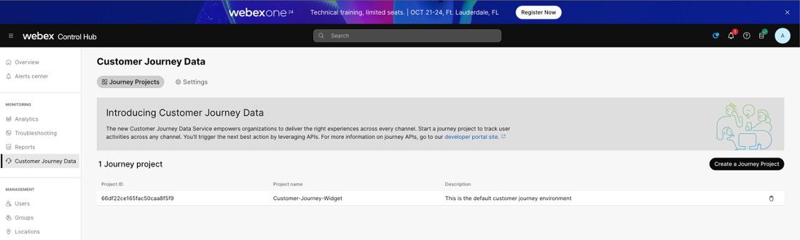
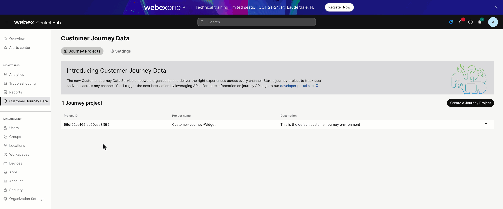

# Lab 1 - Query JDS in an IVR flow for greeting customization.

1. Open Control Hub (admin.webex.com) using Chrome and login with your admin credentials.
2. Select the “Customer Journey Data” option from the Monitoring section in the left pane. You will find a preconfigured Journey Project for this lab.  

    <figure markdown>
    
    </figure>

3. Click your journey project and activate the Webex Contact Center connector:  
    
    <figure markdown>
    
    </figure>
    

4. Note that there’s a “Project ID” assigned to your Journey Project, copy this ID now as we will use it later in this lab.
5. Select the Contact Center option on the Services section in the left pane. Go to “Flows” and open the &lt;flow-name&gt; in Flow Designer.
6. Once you are in the Flow Editor, the first thing we want to do is to create the following flow variables by clicking anywhere in the canvas, not on a specific node. On the right, you will your Flow variables that you created in Lab 1. Click the button to “Add Flow Variable” and create the following variables:
    - Name = JDS_Source, Variable Type = String
    - Name = Welcome_Message_Start, Variable Type = String
    - Name = JDS_PostMessage, Variable Type = String
    - Name = AccessToken, Variable Type = String
    - Name = CHJDS_ProjectID, Variable Type = String, Default Value = &lt;ProjectID&gt; (From step 4)

    <figure markdown>
    
    </figure>

7. Insert a new HTTP Request node AFTER the DB_DIP HTTP Request node. Make sure to Connect the exit connection from the DB_DIP node to the incoming connection on this new node.  This new node will be used to send a query to the JDS service.

    

    - Rename the new HTTP Request node to JDS_Query.
    - On the Connector drop down select the CJDS Connector.
    - Set the Request URL to:

        <https://api.wxcc-us1.cisco.com/v1/api/events/workspace-id/>

    - At the end the of the URL you must add your JDS Project ID (Workspace ID and Project ID are the same). This value is stored in the variable CHJDS_ProjectID.

        [https://api.wxcc-us1.cisco.com/v1/api/events/workspace-id/**xxxxxxxxxxxxxxx**](https://api.wxcc-us1.cisco.com/v1/api/events/workspace-id/xxxxxxxxxxxxxxx)

    - Set the Method to: **GET**
        - Add three Query Parameters and set their values to the following:
          * Key = **identity,** VALUE **= {{NewPhoneContact.ANI |  urlencode }}**
          * Key = **pagesize,** VALUE **= 1**
          * KEY = **filter,**  VALUE = **source%3D%3D%27web%27**
    - Set the Content Type to **Application/JSON**
    - Now edit the Parse Setting and set the following:
          * Content Type to **JSON**
          * Output Variable = **JDS_Source**
          * Path Expression = **$.data\[0\].source**
  
  
  

8. Drag and drop another HTTP Request node from the left node pallet to the canvas and move it below the JDS_Query node you just added in the previous step.

    

    - Connect the exit of the JDS_Query node to the entry of this new node.
    - Rename this new HTTP Request node to **Webhook_Debug_JDSGet**
    - Turn off “**Use Authenticated Endpoint**”
    - Open a tab on your browser and navigate to <https://webhook.site>. Once there you will see a middle pane with a unique URL and email address. Copy the unique URL link, DON’T copy the link for the email address. Leave this browser tab open since we will use it to debug our IVR REST calls.
    - Paste this URL into the Request Path field on the Webhook**\_Debug_JDSGet** node.
    - Set the Method to: **POST**
    - Scroll down to the Content Type field above the Request Body and set it to: **Application/JSON**
    - Set the Request Body to:  
    **{**
    **Type: "JDS Query",**
    **Node: "JDS_QUERY",**
    **JDS_Source: "{{JDS_Source}}"**
    **}**
  
  
  
  
  
  
  

9. Drag and drop a Condition node from the left node pallet.
    - Rename the node to **Check_JDS_Value**
        - Set the Expression to **{{JDS_Source== 'web'}}**
    - Connect the exit of the **Webhook_Debug_JDSGet** node to the entry of this new condition node.

    <figure markdown>
    
    </figure>

10. Drag and drop a Set Variable node from the node pallet to the right of the Check_JDS_Value node.
    - Connect the True branch of the Check_JDS_Value node to the entry of this new node.
    - Rename this node to **Welcome_Back**
    - Under the Variable Settings, select the Variable = **Welcome_Message_Start** and set the Set Value = **Welcome Back {{FirstName}}{{LastName}}**
    - Connect the exit connector to the entry connector of the **WelcomeCustomer** node

    <figure markdown>
    
    </figure>

11. Drag and drop a Set Variable node from the node pallet to the right of the Check_JDS_Value node.
    - Connect the False branch of the Check_JDS_Value node to the entry of this new node.
    - Rename this node to **Welcome**
    - Under the Variable Settings, select the Variable = **Welcome_Message_Start** and set the Set Value = **Hello {{FirstName}}{{LastName}}.**
    - Connect the exit connector to the entry connector of the **WelcomeCustomer** node
    <figure markdown>
    
    </figure>

12. Edit the **WelcomeCustomer** and replace the Text-to-Speech Message to the following:

    **{{Welcome_Message_Start}}. Our records show that in {{LastPurchase}} you purchased {{Product}} in the amount of ${{Balance}}. Have you been satisfied with this product? If you have been satisfied, please press 1. If you have had any issues, please press 2. If you are looking to upgrade your outfit with some sweet accessories, please press 3.**
    <figure markdown>
    
    </figure>

1. Next let us test the JDS query and make sure it works. The idea here is that because we injected an event from the website in the first part of this lab, we will query for that event and if we find it, customize our message to our customer. We either greet them with “Welcome Back…” or “Hello…” We will also see a post event written to webhook.site showing the value of the JDS_Source which should be “web”.
    - Publish your flow, then dial the IVR and put in your test customer account number and you should see an event show up on webhook.site. Inspect that event and you will see the following in Raw Content. This is the body that you passed to the Webhook_Debug_JDSQuery node. This should say “web” because if you recall, when we checked the Page Visit JDS post event earlier in this lab via Postman, we set the source = “web”.
    <figure markdown>
    
    </figure>