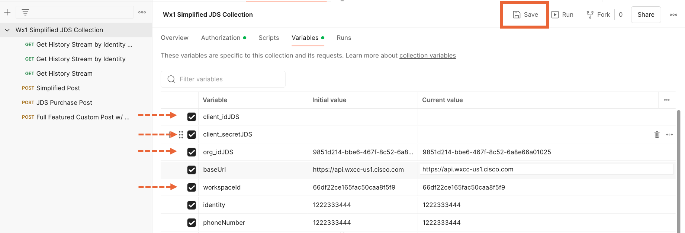
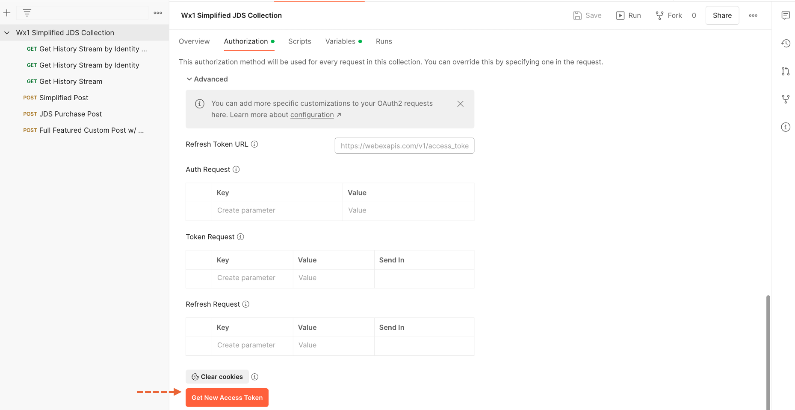
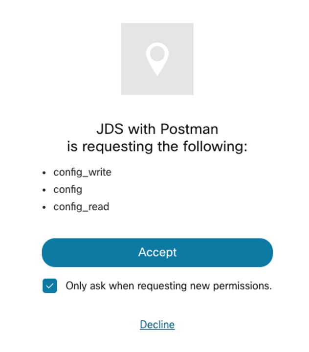
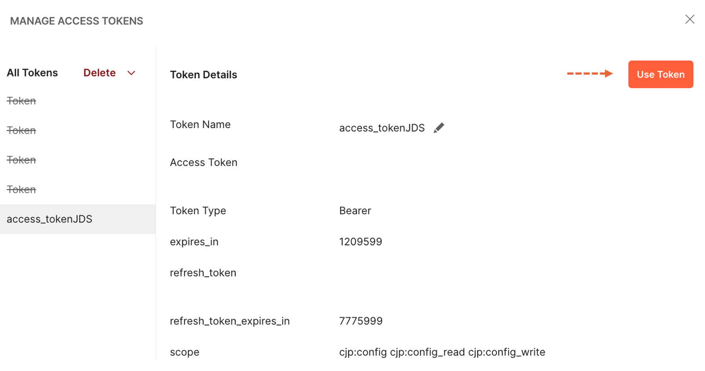
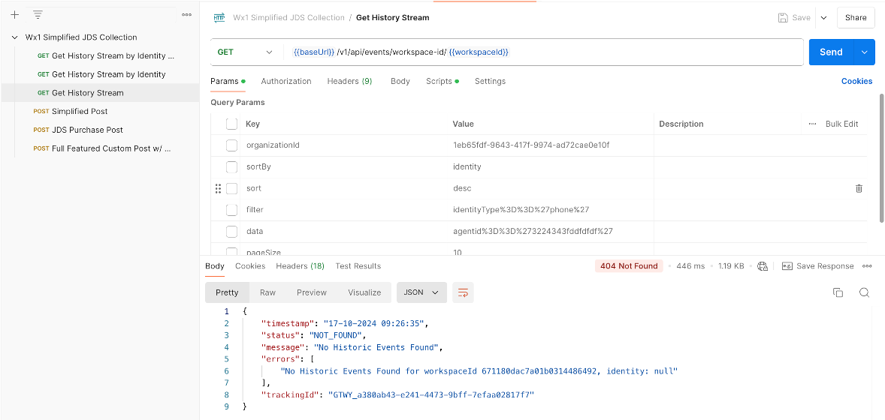
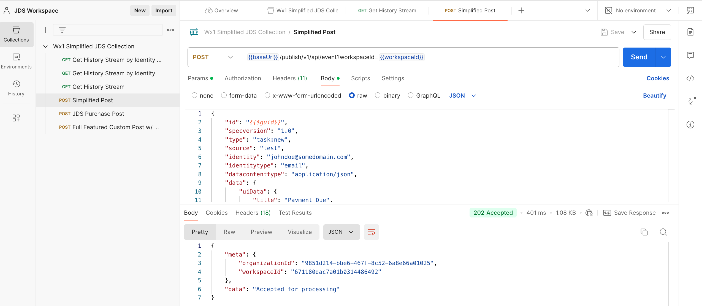
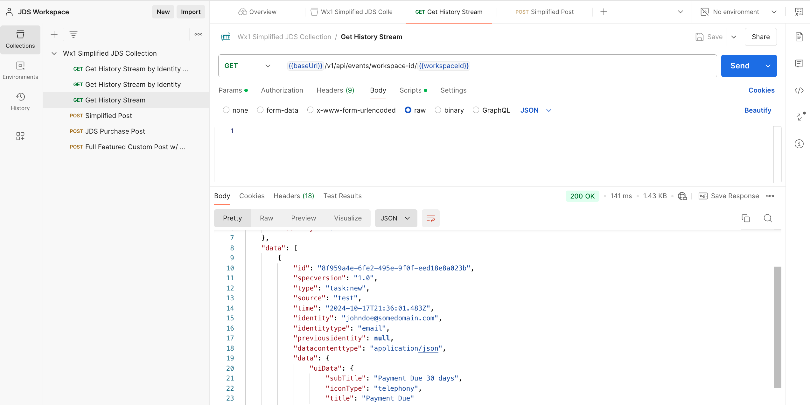

# Lab 1 - Using POSTMAN to interact with JDS

## Lab 1.1 Enable the WxCC Connector in your JDS Project
???+ webex "Instructions"

    1. Open Control Hub (admin.webex.com) using Chrome and login with your admin credentials.
    2. Select the “Customer Journey Data” option from the Monitoring section in the left pane. You will find a preconfigured Journey Project for this lab.  

        ???+ info "Customer Journey Data IMG"
            <figure markdown>
            
            </figure>

    3. Click your journey project and activate the Webex Contact Center connector:  
        
        ???+ tip "WxCC Connector GIF"
            <figure markdown>
            
            </figure>
        

    4. Note that there’s a “Project ID” assigned to your Journey Project, copy this ID now as we will use it later in this lab.

## Lab 1.2 Create a Webex App Integration
???+ webex "Instructions"

    1. Navigate to the <a href="https://developer.webex-cx.com" target="_blank">Contact Center for Developers</a> website. 
    2. Login via the button on the top right and use your admin credentials. 
    3. Once logged in navigate to “My Webex Apps” under your login avatar at the top right and then select “Create a New App”. 
    4. Create a new App with these parameters:

        - Integration Name : JDS with POSTMAN
        - Description: JDS with POSTMAN  
        - Redirect URL(s): https://oauth.pstmn.io/v1/callback
        - Scopes: Check the top three check boxes.
            ```
            -cjp:config
            -cjp:config_write
            -cjp:config_read
            ```
        - Accept the terms check box.
        - Click Add Integration

        ???+ tip "Webex App Integration GIF"
            <figure markdown>
            
            </figure>

    5. Copy and save the Client ID and the Client Secret. 

## Lab 1.3 Configure Postman to send APIs to JDS

!!! note
    You can find the full API documentation <a href="https://developer.webex-cx.com/documentation/journey" target="_blank">here</a>

???+ webex "Instructions"
    
    You should see the collection that was exported during the Getting Started section of the lab. Now let’s change some of the collection settings: 

    1. Click on the collection name "Wx1 Simplified JDS Collection" in the left panel and you will see the settings. 

    2. Click on the Variables tab and update the following fields, set the Initial and Current value to the same values described below:

        - client_idJDS – Set this to the Client ID for the Webex App you added earlier named JDS with POSTMAN
        - client_secretJDS – Set this to the Client Secret for the Webex App you added earlier named JDS with POSTMAN
        - org_idJDS – This is optional but set it to your Control Hub ORG ID
        - workspaceId – In Control Hub, open up the Customer Journey option under Monitoring and copy your project id of your “New Sandbox JDS” JDS project and place it in this field. Do not copy the old “sandbox” one!
        !!! warning
            Make sure you hit **SAVE** after modifying the variables. 
        ???+ info "Postman Authentication Variables IMG"
            <figure markdown>
            
            </figure>

    4. Now click on the Authorization sub tab to the left of the Variables tab and scroll to the bottom of the screen.

    5. Click on the orange “Get New Access Token” button.

        ???+ info "Get New Access Token IMG"
            <figure markdown>
            
            </figure>

    6. A Webex login window will pop up, enter the admin sandbox credentials that you used to create the Webex App integration. 

        ???+ info "Postman Permission Request IMG"
            <figure markdown>
            { width="300" }
            </figure>
        
    7. You should see a window with the token, select the option "Use Token". This will provide POSTMAN the bearer Access Token and a Refresh Token to use with all your imported POSTMAN calls for JDS. POSTMAN will also manage the Access Token expiration by using the Refresh Token on your behalf.

        ???+ info "Postman Token IMG"
            

## Lab 1.4 Sending API Calls to CJDS using POSTMAN
???+ webex "Instructions"

    Let’s test one of the API calls from the POSTMAN collection to confirm it works.

    1. Under the Wx1 Simplified JDS Collection on the left navigation pane, Click the green “GET” named “Get History Stream”. This will open the REST call in a tab on the right. Click the blue “Send” button and you should see a message of “No Historic Journey Events Found” at the bottom of screen in the response area of POSTMAN.

        ???+ info "GET History IMG"
            <figure markdown>
            
            </figure>

    2. Now open the POST call named “Simplified Post” located on the left side under the Wx1 Simplified JDS Collection. Edit the Body of the call and change the identity to a fake email account. Once this is done hit the blue “Send” button on the top right side of the screen. You should get a response stating that the data was “Accepted for processing”.

        ???+ info "Simplified JDS POST IMG"
            <figure markdown>
            
            </figure>

    3. Now run your “Get History Stream” call again and you should see your new event in the JDS tape!

        ???+ info "GET History IMG"
            <figure markdown>
            
            </figure>


Congratulations! You have completed this section of the lab.