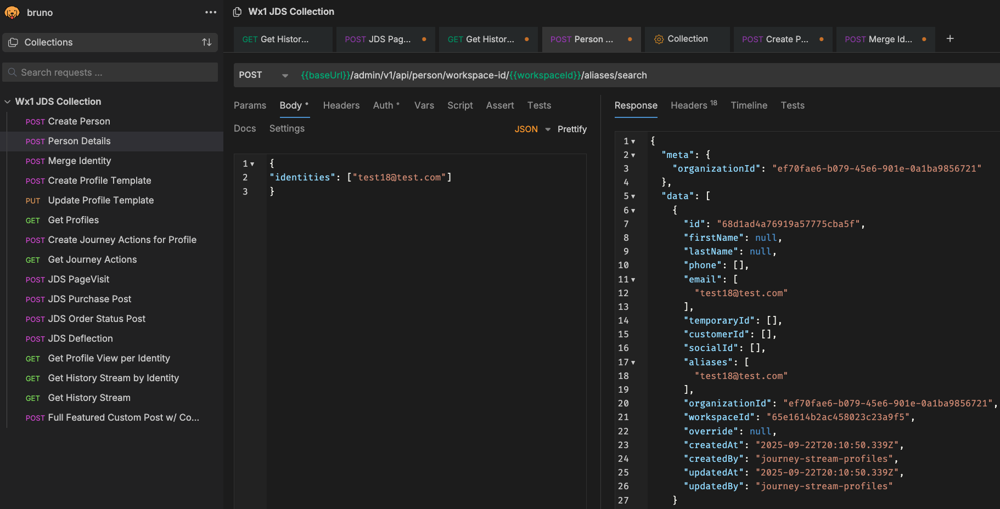
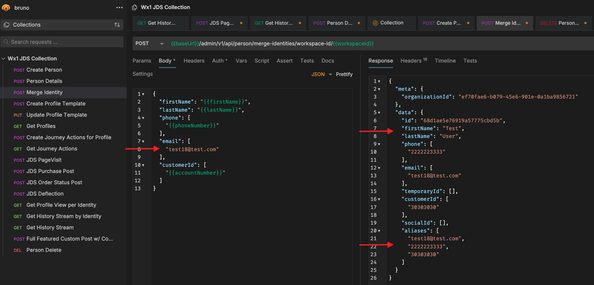
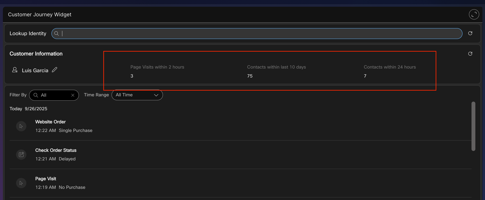

# JDS Identity Management, Progressive Profiles and Actions. 

## Lab 2.1 Identity Management

???+ webex "Instructions"

    1. In the previous lab, we sent an event to JDS using a fake email as the identity. However, we did not create this identity in JDS ahead of time. Let's check what is the current view of this "person" within JDS. Go to the "Person Details" request, enter the fake email you used on the identities section and send the request: 

        ???+ info "Empty Identity IMG"
            <figure markdown>
            
            </figure>

    2. In the response, you can see that there's no name, phone or customer id. JDS automatically created this profile when you sent the previous event, let's use the merge API to add more details to this person profile. Select the Merge Identity API in Bruno and fill out the fields in the body section of the request. Send the request to push this data to the existing identity: 

        ???+ info "Merge Identity IMG"
            <figure markdown>
            
            </figure>

    ???+ note
        There are other ways to create and edit Identities in JDS. You can create identities in bulk from the Control Hub or create person profiles programmatically by using the Create Person API. 

## Lab 2.2 Adding JDS to the Navigation page of the Agent Desktop. 

The JDS widget is now included in the Default Desktop Layout, but for this lab we would like to see the JDS widget without an active interaction. In order to do this, you have to add the JDS widget to the navigation pane section of the Desktop Layout. 

???+ webex "Instructions"
    1. In Control Hub, go to the Desktop Layouts menu. Click the option "Create Desktop Layout", a menu to configure your template will come up, enter the name POD-XX_Layout and select the Team associated to your POD number. 
    2. Download the "Default Desktop Layout" and open it using Notepad++. Find the Navigation section and replace the existing data with the following widget information:
    ```
    {
      "nav": {
        "label": "Journey Data Services",
        "icon": "accessories",
        "iconType": "momentum",
        "navigateTo": "customerJourneyWidget",
        "align": "top"
      },
      "page": {
        "id": "customerJourneyWidget",
        "widgets": {
          "right": {
            "comp": "customer-journey-widget",
            "script": "https://journey-widget.webex.com",
            "attributes": {
              "show-alias-icon": "true",
              "condensed-view": "true",
              "enable-user-search": "true"
            },
            "properties": {
              "bearerToken": "$STORE.auth.accessToken",
              "organizationId": "$STORE.agent.orgId",
              "dataCenter": "$STORE.app.datacenter"
            },
            "wrapper": {
              "title": "Customer Journey Widget",
              "maximizeAreaName": "app-maximize-area"
            }
          }
        },
        "layout": {
          "areas": [
            [
              "right"
            ]
          ],
          "size": {
            "cols": [
              1
            ],
            "rows": [
              1
            ]
          }
        }
      }
    }
    ```

     3. Save the changes in the file and select the option "Replace file" back in the Desktop Layout menu. Select the modified file and the click the "Create" option. 
     4. In an incognito window, navigate to the <a href="https://desktop.wxcc-us1.cisco.com/" target="_blank">WxCC Agent Desktop</a> and use your Agent credentials provided by a lab proctor to login.
     5. Set your "Station Credentials" to **Desktop** telephony option.
     6. You should now see the JDS widget in the navigation page, select it and do a search for your identity. 
     7. The JDS widget should show the events you previously sent and the default profile template metrics in the JDS widget header. 

     Now let's create your own Profile Template to modify the metrics. 

## Lab 2.3 Profile Templates
Administrators can use profile templates to customize the data presented to the Agent in the JDS widget header, in this lab section you will create a profile that displays the amount of Page Visit events in the last 120 minutes. 
            <figure markdown>
            
            </figure>

???+ webex "Instructions"
    1. Using Bruno, select the API called "Create Profile Template". You can add multiple metrics to a profile, modify the first entry in the API JSON to match the following: 
    ```
    "name": "PageVisits_PODXX",
    "attributes": [
        {
            "version": "1.0",
            "event": "task:new",
            "metaDataType": "string",
            "metaData": "channelType",
            "limit": 100,
            "displayName": "Page Visits within 2 hours",
            "lookBackDurationType": "minutes",
            "lookBackPeriod": 120,
            "aggregationMode": "Count",
            "rules": {
                "logic": "SINGLE",
                "condition": "task:new,channelType,string,Value EQ Website"
            },
            "widgetAttributes": {
                "type": "table"
            },
            "verbose": false
        },
    ```
    2. Confirm that the other metrics for "Contacts within 10 days" and "Contacts within 24 hours" are included in the JSON body. 
    3. Send the POST API call to create the profile.
    4. Select the GET Profiles API and run it to confirm you see both the default profile template and your new profile template. Copy the id of your profile template. 
    5. Open the Desktop Layout you previously modified, you need to configure your template ID into it so that the JDS widget know what information to show. 
    6. In the Desktop Layout, you need to modify the JDS widget that comes up when calls or digital tasks are active, and the JDS widget in the navigation pane. Add the line "template-id": "<YOUR_TEMPLATE_ID>" to the attributes section, Here's an example: 
    **Navigation pane:**
    ```
    "page": {
            "id": "customerJourneyWidget",
            "widgets": {
              "right": {
                "comp": "customer-journey-widget",
                "script": "https://journey-widget.webex.com",
                "attributes": {
                  "condensed-view": "true",
                  "show-alias-icon": "true",
                  "template-id": "68d627030750c0634702a46e"
                },
    ```
    **Active Task Widget:**
    ```
    {
            "comp": "md-tab-panel",
            "attributes": {
              "slot": "panel",
              "class": "widget-pane"
            },
            "children": [
              {
                "comp": "customer-journey-widget",
                "script": "https://journey-widget.webex.com",
                "attributes": {
                  "show-alias-icon": "true",
                  "condensed-view": "true",
                  "template-id": "68d627030750c0634702a46e"
                }
    ```
    7. Save and upload the new desktop layout file. 
    8. Reload the agent desktop and confirm that the new profile template value is coming up. 


## Lab 2.4 JDS Actions

Although, being able to aggregate and define the data within the profile template can be very useful for customers. We algo got something better.. JDS Actions. Within a profile, you can configure Actions that will take place when a certain threshold is met. Meaning you could trigger actions if you see more than 2 abandoned calls from a customer on the same day or offer a discount to someone that visited your online store 3 times on the same day. Let's check how this works! 


Create Webex Connect webhook flow
Create action inside the progressive profile
Test action


Congratulations! You have completed this section of the lab.
