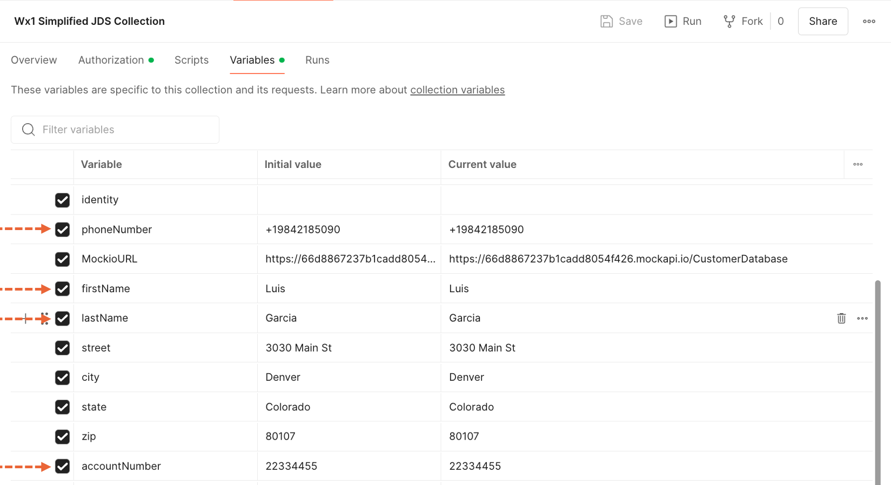
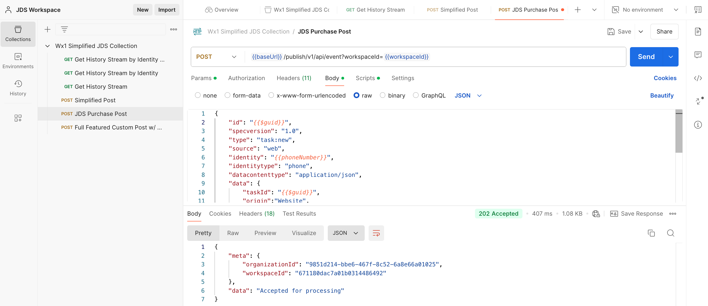
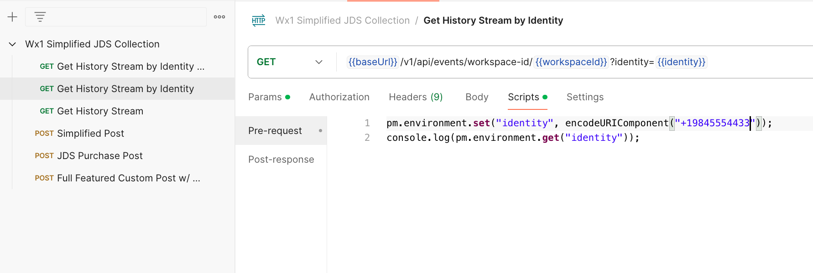
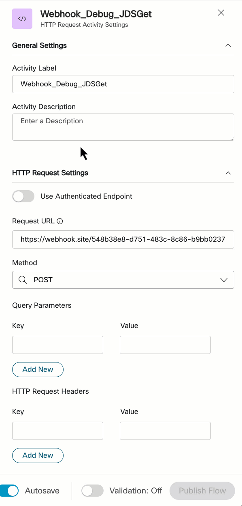
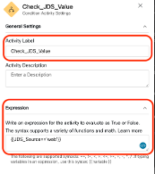
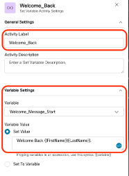
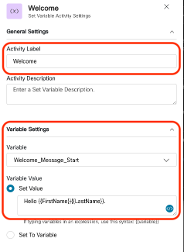
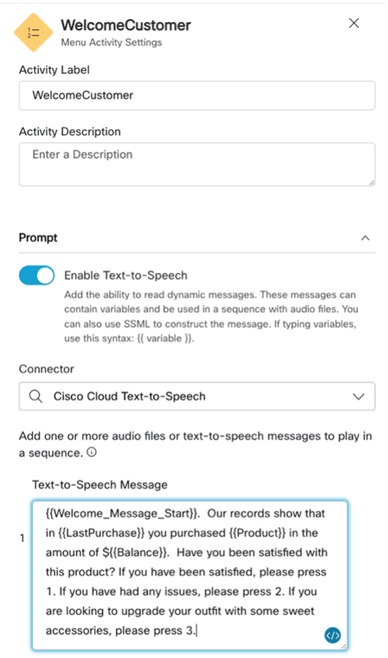
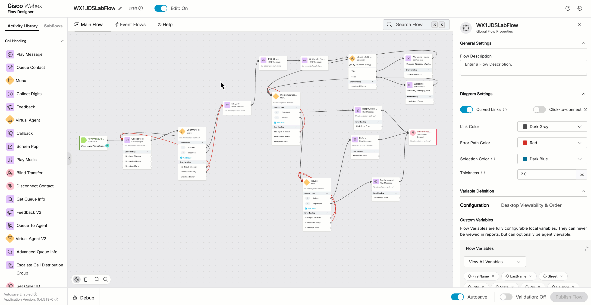
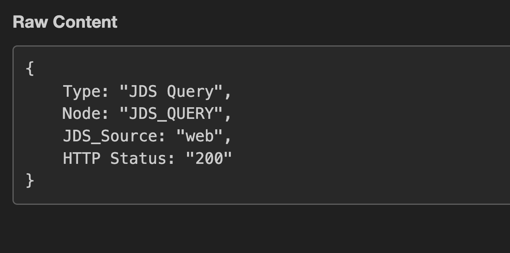

# Query JDS in an IVR flow for greeting customization.

## Lab 2.1 Send events to JDS using Postman
???+ webex "Instructions"

    1. We will start by sending a JDS event using Postman. Open the variables section of the Postman collection and update the following variables: 

        - The variables firstName, lastName and address information can be random. 
        - The phoneNumber has to match the PSTN number you will use to call, make sure the + is included. 
        - The accountNumber can be random, but it needs to be 8 digits long. 

        !!! warning
            Make sure you hit **SAVE** after modifying the variables. 

        ???+ info "Postman Variable IMG"
            <figure markdown>
            
            </figure>

    2. Select the POST called "JDS Purchase Post" and click the "Send" button. You should receive an "Accepted for processing" message. 

        ???+ info "JDS Purchase Post IMG"
            <figure markdown>
            
            </figure>

    3. Let's confirm the event was successfully processed. Select the GET called "Get History Stream by Identity", select the "Scripts" tab and type your number including the + sign. 

        ???+ info "JDS Purchase Post IMG"
            <figure markdown>
            
            </figure>

    4. Send the GET message and you will see the event we sent via API in step 2. 

## Lab 2.2 Setup your IVR flow to query JDS events. 
???+ webex "Instructions"
    1. Select the Contact Center option on the Services section in the left pane. Go to “Flows” and open the &lt;flow-name&gt; in Flow Designer.

    2. Once you are in the Flow Editor, the first thing we want to do is to create the following flow variables by clicking anywhere in the canvas, not on a specific node. On the right, you will your Flow variables that you created in Lab 1. Click the button to “Add Flow Variable” and create the following variables:
        - Name = JDS_Source, Variable Type = String
        - Name = Welcome_Message_Start, Variable Type = String
        - Name = JDS_PostMessage, Variable Type = String
        - Name = AccessToken, Variable Type = String
        - Name = Customer_Resolution, Variable Type = String
        - Name = CHJDS_ProjectID, Variable Type = String, Default Value = &lt;ProjectID&gt; (From step 4)
        ???+ tip "Flow Variables GIF"
            <figure markdown>
            
            </figure>


    3. Insert a new HTTP Request node AFTER the DB_DIP HTTP Request node. Make sure to Connect the exit connection from the DB_DIP node to the incoming connection on this new node.  This new node will be used to send a query to the JDS service.

        - Rename the new HTTP Request node to JDS_Query.
        - On the Connector drop down select the CJDS Connector.
        - Set the Request URL to:

            **/v1/api/events/workspace-id/**

        - At the end the of the URL you must add your JDS Project ID (Workspace ID and Project ID are the same). This value is stored in the variable CHJDS_ProjectID.

            **/v1/api/events/workspace-id/xxxxxxxxxxxxxxx**

        - Set the Method to: **GET**
            - Add three Query Parameters and set their values to the following:
            * Key = **identity** VALUE **= {{NewPhoneContact.ANI |  urlencode }}**
            * Key = **pagesize** VALUE **= 1**
            * KEY = **filter**  VALUE = **source%3D%3D%27web%27**
        - Set the Content Type to **Application/JSON**
        - Now edit the Parse Setting and set the following:
            * Content Type to **JSON**
            * Output Variable = **JDS_Source**
            * Path Expression = **$.data\[0\].source**

        ???+ tip "JDS_Query GIF"
            <figure markdown>
            
            </figure>
    

    8. Drag and drop another HTTP Request node from the left node pallet to the canvas and move it below the JDS_Query node you just added in the previous step.
        - Connect the exit of the JDS_Query node to the entry of this new node.
        - Rename this new HTTP Request node to **Webhook_Debug_JDSGet**
        - Turn off “**Use Authenticated Endpoint**”
        - Open a tab on your browser and navigate to <https://webhook.site>. Once there you will see a middle pane with a unique URL and email address. Copy the unique URL link, DON’T copy the link for the email address. Leave this browser tab open since we will use it to debug our IVR REST calls.
        - Paste this URL into the Request Path field on the **Webhook_Debug_JDSGet** node.
        - Set the Method to: **POST**
        - Scroll down to the Content Type field above the Request Body and set it to: **Application/JSON**
        - Set the Request Body to:

        ``` JSON
        {
            Type: "JDS Query",
            Node: "JDS_QUERY",
            JDS_Source: "{{JDS_Source}},
            HTTP Status: "{{JDS_Query.httpStatusCode}}"
            }
        ```

        ???+ tip "Webhook Debug GIF"
            <figure markdown>
            
            </figure>


    9. Drag and drop a Condition node from the left node pallet.
        - Rename the node to **Check_JDS_Value**
        - Set the Expression to:
            ```
            {{JDS_Source== 'web'}}
            ```
        - Connect the exit of the **Webhook_Debug_JDSGet** node to the entry of this new condition node.
        ???+ note "Check JDS Value IMG"
            <figure markdown>
            
            </figure>

    10. Drag and drop a Set Variable node from the node pallet to the right of the Check_JDS_Value node.
        - Connect the True branch of the Check_JDS_Value node to the entry of this new node.
        - Rename this node to **Welcome_Back**
        - Under the Variable Settings, select the Variable = **Welcome_Message_Start** and set the Set Value = **Welcome Back {{FirstName}}{{LastName}}**
        - Connect the exit connector to the entry connector of the **WelcomeCustomer** node

        ???+ note "Set Welcome Back Variable IMG"
            <figure markdown>
            
            </figure>

    11. Drag and drop a Set Variable node from the node pallet to the right of the Check_JDS_Value node.
        - Connect the False branch of the Check_JDS_Value node to the entry of this new node.
        - Rename this node to **Welcome**
        - Under the Variable Settings, select the Variable = **Welcome_Message_Start** and set the Set Value = **Hello {{FirstName}}{{LastName}}.**
        - Connect the exit connector to the entry connector of the **WelcomeCustomer** node

        ???+ note "Set Welcome Variable IMG"
            <figure markdown>
            
            </figure>

    12. Edit the **WelcomeCustomer** and replace the Text-to-Speech Message to the following:

        **{{Welcome_Message_Start}}. Our records show that in {{LastPurchase}} you purchased {{Product}} in the amount of ${{Balance}}. Have you been satisfied with this product? If you have been satisfied, please press 1. If you have had any issues, please press 2.**

        ???+ note "Welcome Message IMG"
            <figure markdown>
            
            </figure>

    13. Next let us test the JDS query and make sure it works. The idea here is that because we injected an event using Postman in the first part of this lab, we will query for that event and if we find it, customize our message to our customer. We either greet them with “Welcome Back…” or “Hello…” We will also see a post event written to webhook.site showing the value of the JDS_Source variable which should be “web”.
        - Publish your flow

        ???+ tip "Publish Flow"
            <figure markdown>
            
            </figure>
        
        - Dial the IVR and follow the prompts.  First it will ask for the account number that you setup in the Postman variables, once you confirm the account, you will hear the Welcome message. If the prompt says "Welcome Back", it means the flow was configured correctly. You can disconnect the call now. 
        
        - You should also see an event show up on webhook.site. Inspect that event and you should see the following in Raw Content. 
        
        ???+ note "Webhook site JDS_Source IMG"
            <figure markdown>
            
            </figure>
        
        - This is the body that you passed to the Webhook_Debug_JDSQuery node. The JDS_Source variable should say "web", because the "JDS Purchase POST" we sent was set to "source": "web".
    
        ???+ warning
            If you did not hear the "Welcome Back" message, confirm that the JDS event you sent using the "JDS Purchase POST" exists, this can be done by running the "Get History Stream by Identity" API. Check the value of the {{JDS_Query.httpStatusCode}} variable, this should be posted in the webhook site. 

Congratulations! You have completed this section of the lab.