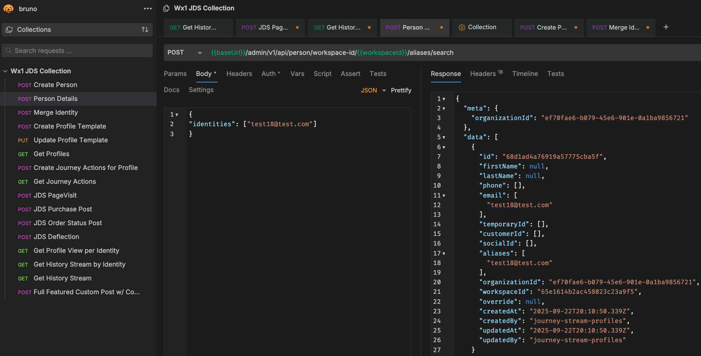
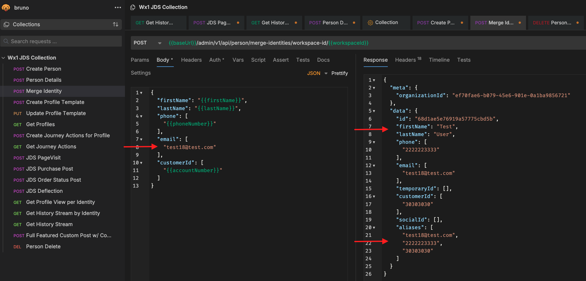
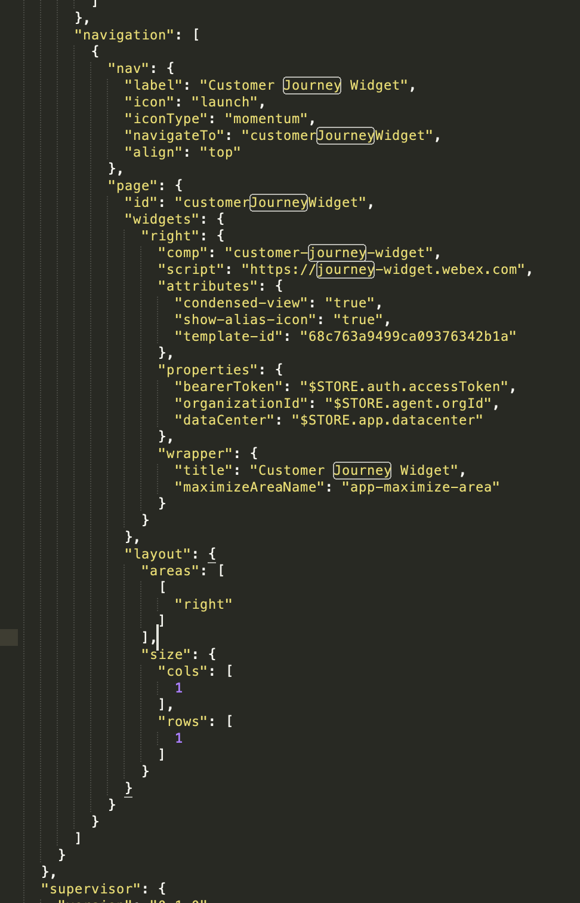
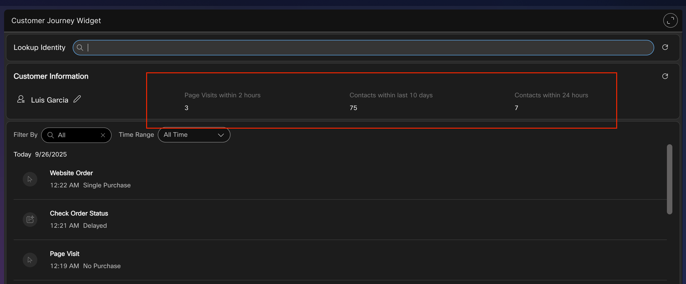

# JDS Identity Management, Progressive Profiles, and Actions :calling: :email:

## Lab 2.1 Identity Management

???+ webex "Instructions"

    1. In the previous lab, we sent a Page Visit event to JDS using a fake email as the identity. However, we did not create this identity in JDS ahead of time. Let's check what is the current view of this person within JDS. Go to the **Person Details** request, enter the fake email you used in the identities section, and send the request:

        ???+ info "Empty Identity IMG"
            <figure markdown>
            
            </figure>

    2. The response has no name, phone, or customer ID. JDS automatically created this profile when you sent the Page Visit event. Use the Merge Identity API to add more details to this person profile. Select **Merge Identity** in Bruno, fill out the fields in the body, and send the request.

        ???+ info "Merge Identity IMG"
            <figure markdown>
            
            </figure>

    4. Click **Get History Stream by identity**, replace the identity with the phone number variable, and send the request. You should see the Page Visit event that was originally associated only with the fake email now associated with the merged phone identity.

        ???+ note
            There are other ways to create and edit identities in JDS. You can create identities in bulk from Control Hub or create person profiles programmatically by using the Create Person API.

## Lab 2.2 Adding JDS to the Navigation Page of the Agent Desktop

The JDS widget is included in the Default Desktop Layout. For this lab, you will add the JDS widget to the navigation pane so that you can view the customer journey without an active interaction.

???+ webex "Instructions"
    1. In Control Hub, go to the Desktop Layouts menu. Click **Create Desktop Layout**. Enter the name `POD-XX_Layout` and select the team associated with your POD number.
    2. Download the <a href="https://github.com/WebexCC-SA/LAB-2851/blob/main/docs/assets/JDS_LAB_Layout.json" target="_blank">JDS_LAB_Layout</a> and open it using Notepad++. Find the Navigation section and replace the existing data with the following widget information:

        ```json
        {
          "nav": {
            "label": "Journey Data Services",
            "icon": "accessories",
            "iconType": "momentum",
            "navigateTo": "customerJourneyWidget",
            "align": "top"
          },
          "page": {
            "id": "customerJourneyWidget",
            "widgets": {
              "right": {
                "comp": "customer-journey-widget",
                "script": "https://journey-widget.webex.com",
                "attributes": {
                  "show-alias-icon": "true",
                  "condensed-view": "true",
                  "enable-user-search": "true"
                },
                "properties": {
                  "bearerToken": "$STORE.auth.accessToken",
                  "organizationId": "$STORE.agent.orgId",
                  "dataCenter": "$STORE.app.datacenter"
                },
                "wrapper": {
                  "title": "Customer Journey Widget",
                  "maximizeAreaName": "app-maximize-area"
                }
              }
            },
            "layout": {
              "areas": [["right"]],
              "size": {
                "cols": [1],
                "rows": [1]
              }
            }
          }
        }
        ```

        **Use the following picture to confirm that you modified the JSON file correctly:**

        ???+ webex "JDS Navigation Section"
            <figure markdown>
            
            </figure>

    3. Save the file. Back in Desktop Layouts, select **Replace file**, select the modified file, and click **Create**.
    4. In an incognito window, navigate to the <a href="https://desktop.wxcc-us1.cisco.com/" target="_blank">WxCC Agent Desktop</a> and sign in with the agent credentials supplied by a lab proctor.
    5. Set your **Station Credentials** to the **Desktop** telephony option.
    6. Select the JDS widget in the navigation pane and search for your identity.
    7. The widget should show the events you previously sent and the default profile-template metrics in the JDS widget header.

    Now create your own profile template to modify the metrics.

## Lab 2.3 Profile Templates

Administrators can use profile templates to customize the data presented to an agent in the JDS widget header. In this section, you will create a profile that displays the number of Page Visit events in the last 48 hours.

<figure markdown>

</figure>

???+ webex "Instructions"
    1. In Bruno, select the API called **Create Profile Template**. You can add multiple metrics to a profile. Modify the first entry in the API JSON as follows. Keep the existing `task:new` event type and Page Visit rule; only the lookback window has changed from two hours to 48 hours.

        ```json
        "name": "PageVisits_PODXX",
        "attributes": [
          {
            "version": "1.0",
            "event": "task:new",
            "metaDataType": "STRING",
            "metaData": "channelType",
            "limit": 100,
            "displayName": "Page Visits within 48 hours",
            "lookBackDurationType": "HOURS",
            "lookBackPeriod": 48,
            "aggregationMode": "COUNT",
            "rules": {
              "logic": "SINGLE",
              "condition": "task:new,channelType,string,Value EQ Website"
            },
            "widgetAttributes": {
              "type": "table"
            },
            "verbose": false
          }
        ```

    2. Confirm that the other metrics for **Contacts within 10 days** and **Contacts within 24 hours** are included in the JSON body.
    3. Send the POST API call to create the profile.
    4. Select the **GET Profiles** API and run it to confirm that both the default profile template and your new profile template are present. Copy the ID of your profile template.
    5. Open the Desktop Layout you previously modified. Configure your template ID in the layout so that the JDS widget knows which information to show.
    6. Modify both the JDS widget shown for active calls and the JDS widget in the navigation pane. Add `"template-id": "<YOUR_TEMPLATE_ID>"` to the attributes section.

        **Navigation pane:**

        ```json
        "page": {
          "id": "customerJourneyWidget",
          "widgets": {
            "right": {
              "comp": "customer-journey-widget",
              "script": "https://journey-widget.webex.com",
              "attributes": {
                "condensed-view": "true",
                "show-alias-icon": "true",
                "template-id": "68d627030750c0634702a46e"
              }
        ```

        **Widget for active calls:**

        ```json
        {
          "comp": "md-tab-panel",
          "attributes": {
            "slot": "panel",
            "class": "widget-pane"
          },
          "children": [
            {
              "comp": "customer-journey-widget",
              "script": "https://journey-widget.webex.com",
              "attributes": {
                "show-alias-icon": "true",
                "condensed-view": "true",
                "template-id": "68d627030750c0634702a46e"
              }
        ```

    7. Save and upload the new Desktop Layout file.
    8. Reload Agent Desktop and confirm that the new profile-template value appears.

## Lab 2.4 Journey Action for the Page Visit Profile

This addition extends the progressive profile that you created in Lab 2.3.

???+ info "Shared Webex Connect webhook"
    This lab uses one shared Webex Connect webhook. It requests a one-time Webex Sneakers discount code and sends the SMS message. Your instructor provides the webhook URL at the beginning of the lab.

???+ webex "Create the Journey Action"
    1. In Bruno, run **Get Profiles** and copy the ID of `PageVisits_PODXX`.
    2. Open the collection **Variables** tab and set these values:

        | Variable | Value |
        | --- | --- |
        | `pageVisitProfileTemplateId` | The ID of `PageVisits_PODXX` that you copied. |
        | `journeyActionWebhookUrl` | The shared Webex Connect webhook URL supplied for the lab. |
        | `journeyActionName` | `Webex Sneakers Page Visit Discount` |

    3. Open **Create Page Visit Journey Action**. The request creates an active action beneath your existing progressive profile:

        ```json
        {
          "name": "{{journeyActionName}}",
          "isActive": true,
          "cooldownPeriodInMinutes": 1440,
          "rules": {
            "logic": "SINGLE",
            "condition": "task:new,channelType,string,value GT 2"
          },
          "actionTriggers": [
            {
              "type": "Webhook",
              "webhookURL": "{{journeyActionWebhookUrl}}",
              "attributes": {
                "httpverb": "post",
                "requestbody": "{\"actionTitle\":\"Webex Sneakers Page Visit Discount\",\"phone\":\"{{phoneNumber}}\",\"identityType\":\"phone\",\"discountPercent\":15,\"expiresInHours\":24}"
              }
            }
          ]
        }
        ```

        The rule fires after the Page Visit profile reaches three events. The profile template limits those events to Website Page Visits in the 48-hour window. The 1,440-minute cooldown prevents another discount from being sent to this lab identity for 24 hours.

    4. Send the POST request. A successful response creates the Journey Action.
    5. Run **Get Page Visit Journey Actions**. Confirm that `Webex Sneakers Page Visit Discount` is active and that its trigger uses the shared Webex Connect URL.

???+ webex "Trigger and validate the action"
    1. In **JDS PageVisit**, set the identity to the `phoneNumber` collection variable and set `identitytype` to `phone`.
    2. Send the request three times, using a distinct event ID each time.
    3. Use **Get History Stream by identity** with the phone number to confirm the three Page Visit events.
    4. Confirm that your phone receives one Webex Sneakers discount code. Keep that code for Lab 4.

Congratulations! You have completed this section of the lab.
