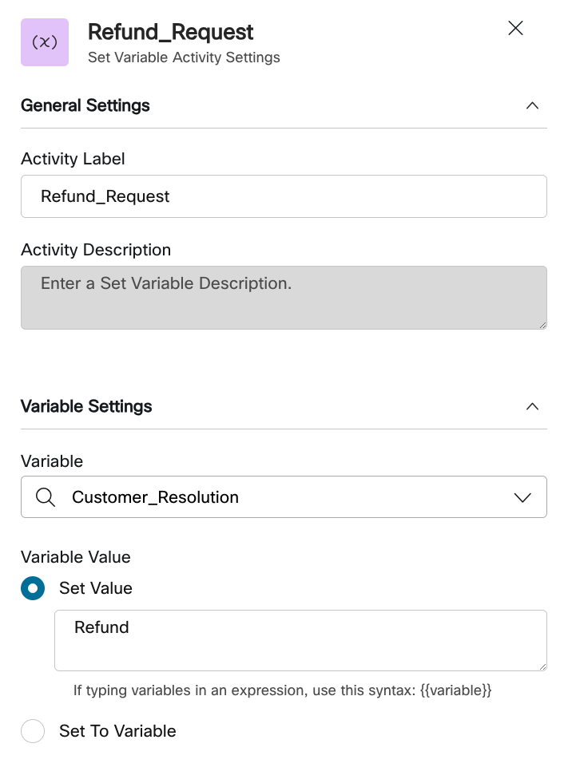
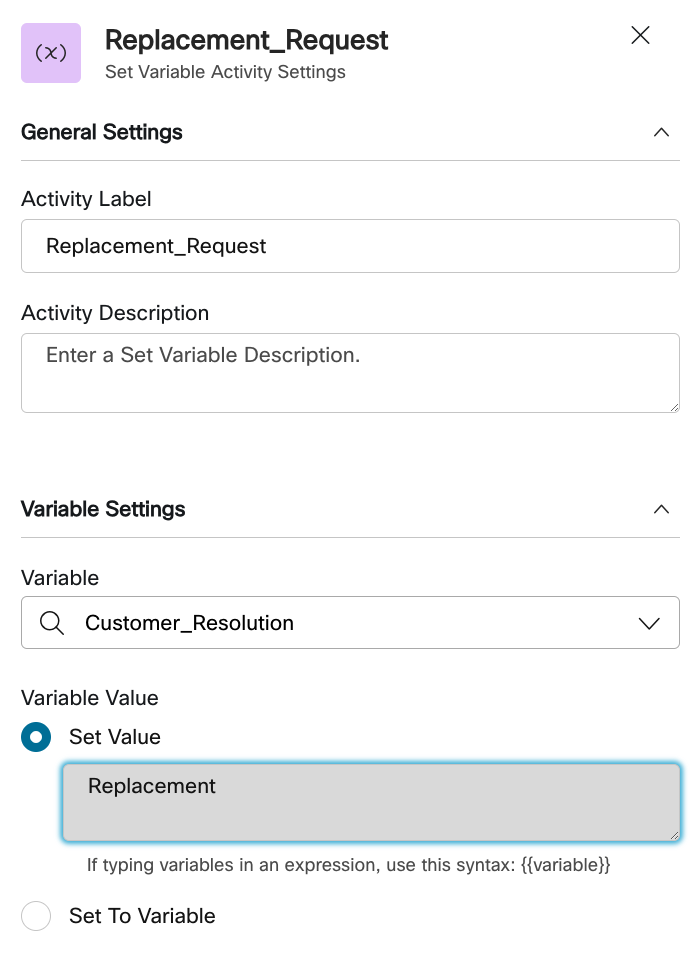
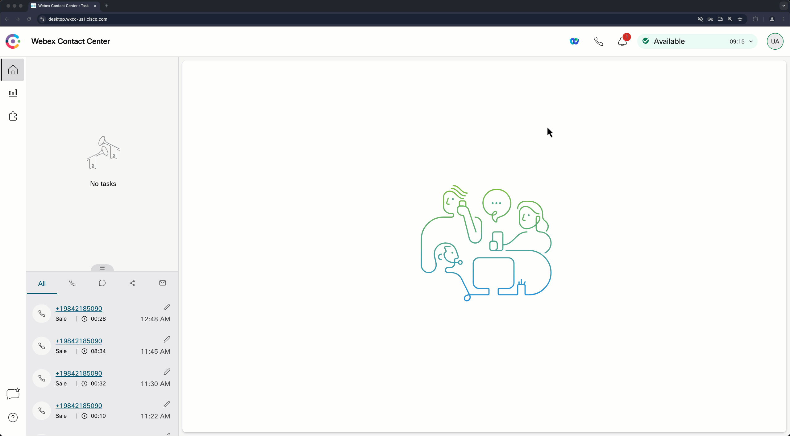
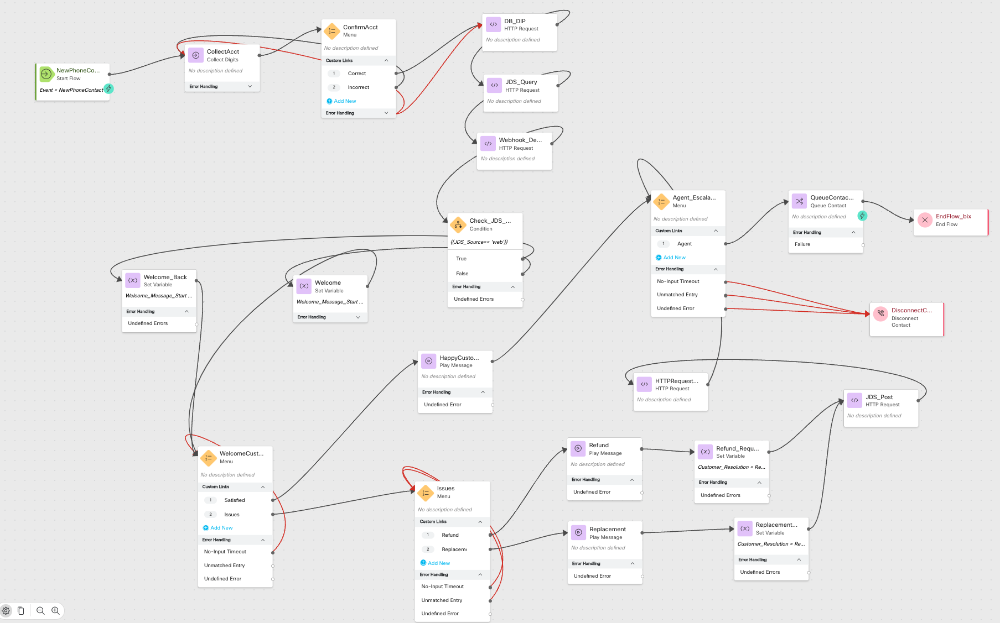

# Injecting custom JDS events from Flow Designer

## Lab 3.1 Setup your IVR flow to POST JDS events

???+ webex "Instructions"
    1. In the WX1JDSLabFlow, add a Set Variable node after the "Refund" node. Change the name of the node to **Refund_Request**, select the variable **Customer_Resolution** and set the value to `Refund`. 

        ???+ info "Refund Request Node IMG"
            <figure markdown>
            
            </figure>
    - Remove the connection between the **Refund** and **Agent_Escalation** node and create a connection to this new **Refund_Request** node.

    2. Add another "Set Variable" node after the "Replacement" node. Change the name of the node to **Replacement_Request**, select the variable **Customer_Resolution** and set the value to `Replacement`.

        ???+ info "Replacement Request Node IMG"
            <figure markdown>
            
            </figure>
    - Remove the connection between the **Replacement** and **Agent_Escalation** nodes and create a connection to this new **Replacement_Request** node from the **Replacement** node.

    3. Insert a new HTTP Request node AFTER the **Refund_Request** and **Replacement_Request** nodes. This new node will push an event to the JDS service.

        - Rename the new HTTP Request node to **JDS_Post**.
        - On the Connector drop down select **CJDS Connector**.
        - Set the Request URL to:

                /publish/v1/api/event

        - Set the Method to: **POST**
            - Add one Query Parameter and set the value to the following:
                - Key = **workspaceId** 
                - Value **{{CHJDS_ProjectID}}**
        - Set the Content Type to **Application/JSON**
        - Copy the following JSON into the Request Body: 

            ``` JSON
            {
                "id": "{{NewPhoneContact.interactionId}}",
                "specversion": "1.0",
                "type": "task:new",
                "source": "IVR",
                "identity": "{{NewPhoneContact.ANI}}",
                "identitytype": "phone",
                "datacontenttype": "application/json",
                "data": {
                    "origin":"IVR",
                    "firstName": "{{FirstName}}",
                    "lastName": "{{LastName}}",
                    "phone": "{{NewPhoneContact.ANI}}",
                    "channelType": "Sales",
                    "uiData": {
                        "title": "Product_Dispute",
                        "iconType": "task",
                        "subTitle": "{{Customer_Resolution}}"
                    }
                }
            }
            ```
        ???+ tip "JDS_POST GIF"
            <figure markdown>
            
            </figure>

        - Connect the exit of the **Refund_Request** and **Replacement_Request** nodes to the entry of this new node.

    4. Drag and drop another HTTP Request node close to the **JDS_Post** node. 
        - Connect the exit of the **JDS_Post** node to the entry of this new node, then link this node to the Agent Escalation menu node. 
        - Rename this new HTTP Request node to **Webhook_Debug_JDSPost**
        - Turn off “**Use Authenticated Endpoint**”
        - Paste the webhook.site URL from LAB 1 into the Request Path field on the **Webhook_Debug_JDSPost** node.
        - Set the Method to: **POST**
        - Scroll down to the Content Type field above the Request Body and set it to: **Application/JSON**
        - Set the Request Body to:

            ``` JSON
            {
                {{JDS_Post.httpStatusCode}},
                {{JDS_Post.httpResponseBody}}
            }
            ```

        ???+ tip "Webhook Debug POST GIF"
            <figure markdown>
            
            </figure>
        - Connect the exit of the **Webhook_Debug_JDSPost** node to the entry of the Agent Escalation menu node.

    Our flow is now ready to push events to our JDS workspace, we will use the JDS widget in the WxCC Agent Desktop to confirm it works. 

## Lab 3.2 Agent Desktop JDS Widget

???+ webex "Instructions"

    1. Navigate to the <a href="https://desktop.wxcc-us1.cisco.com/" target="_blank">WxCC Agent Desktop</a> and use your credentials provided by a lab proctor to login.
    2. We have pre-loaded a Desktop Layout that includes the JDS Widget, this will be visible while the agent is working an interaction.
    3. Dial the IVR and follow the prompts. Select the Refund or Replacement options you configured in the flow and escalate the call to an agent. 
    4. Answer the call and confirm the JDS event we posted from the IVR flow is visible. 

        ???+ tip "Agent Desktop JDS Widget GIF"
            <figure markdown>
            
            </figure>

## Final IVR Flow

???+ webex "IVR Flow IMG"
    <figure markdown>
    
    </figure>

Congratulations! You have completed LAB-2851 Integrating Journey Data Service with Webex Contact Center. 