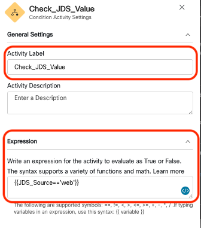
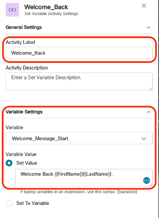
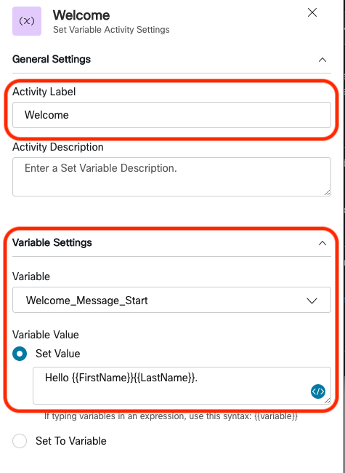
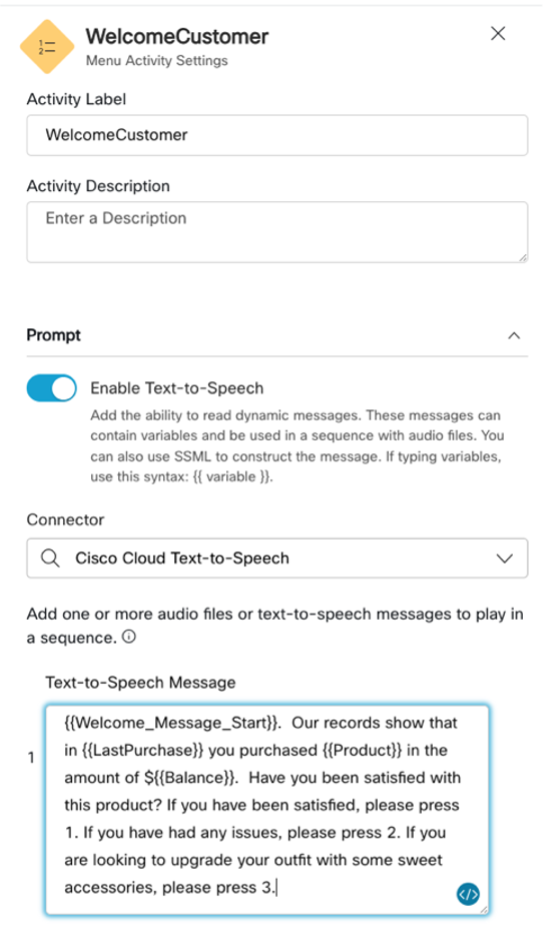

# Using CC data in JDS

Subscription
Connect webhook
Process data and trigger actions

## Lab 2.2 Setup your IVR flow to query JDS events. 
???+ webex "Instructions"
    1. Login to [Webex Control Hub](https://admin.webex.com) with your tenant's administrator account. Select the Contact Center option on the Services section in the left pane. Go to “Flows” and open the &lt;flow-name&gt; in Flow Designer.

    2. Once you are in the Flow Editor, click the "Edit" toggle to switch to Edit mode. The first thing we want to do is to create the following flow variables by clicking anywhere in the canvas, not on a specific node. On the right, you will your Flow variables that you created in Lab 1. Click the button to “Add Flow Variable” and create the following variables:
        - Name = JDS_Source, Variable Type = String
        - Name = Welcome_Message_Start, Variable Type = String
        - Name = JDS_PostMessage, Variable Type = String
        - Name = AccessToken, Variable Type = String
        - Name = Customer_Resolution, Variable Type = String
        - Name = CHJDS_ProjectID, Variable Type = String, Default Value = &lt;ProjectID&gt; (From Lab 1.1, step 4)
        ???+ tip "Flow Variables GIF"
            <figure markdown>
            
            </figure>


    3. Insert a new **HTTP Request** node AFTER the **DB_DIP HTTP Request** node. Make sure to Connect the exit connection from the **DB_DIP** node to the incoming connection on this new node.  This new node will be used to send a query to the JDS service.

        - Rename the new HTTP Request node to JDS_Query.
        - On the Connector drop down select the CJDS Connector.
        - Set the Request URL to:

            **/v1/api/events/workspace-id/{{CHJDS_ProjectID}}**

        - Set the Method to: **GET**
            - Add three Query Parameters and set their values to the following:
            * Key = **identity** VALUE = **{{NewPhoneContact.ANI |  urlencode }}**
            * Key = **pagesize** VALUE = **1**
            * KEY = **filter**  VALUE = **source%3D%3D%27web%27**
        - Set the Content Type to **Application/JSON**
        - Now edit the Parse Setting and set the following:
            * Content Type to **JSON**
            * Output Variable = **JDS_Source**
            * Path Expression = **$.data\[0\].source**

        ???+ tip "JDS_Query GIF"
            <figure markdown>
            
            </figure>
    

    4. Drag and drop another HTTP Request node from the left node pallet to the canvas and move it below the JDS_Query node you just added in the previous step.
        - Connect the exit of the JDS_Query node to the entry of this new node.
        - Rename this new HTTP Request node to **Webhook_Debug_JDSGet**
        - Turn off “**Use Authenticated Endpoint**”
        - Open a tab on your browser and navigate to <https://webhook.site>. Once there you will see a middle pane with a unique URL and email address. Copy the unique URL link, DON’T copy the link for the email address. Leave this browser tab open since we will use it to debug our IVR REST calls.
        - Paste this URL into the Request Path field on the **Webhook_Debug_JDSGet** node.
        - Set the Method to: **POST**
        - Scroll down to the Content Type field above the Request Body and set it to: **Application/JSON**
        - Set the Request Body to:

        ``` JSON
        {
            Type: "JDS Query",
            Node: "JDS_QUERY",
            JDS_Source: "{{JDS_Source}}",
            HTTP Status: "{{JDS_Query.httpStatusCode}}"
        }
        ```

        ???+ tip "Webhook Debug GIF"
            <figure markdown>
            
            </figure>


    5. Drag and drop a Condition node from the left node pallet.
        - Rename the node to **Check_JDS_Value**
        - Set the Expression to:
            ```
            {{JDS_Source== 'web'}}
            ```
        - Connect the exit of the **Webhook_Debug_JDSGet** node to the entry of this new condition node.
        ???+ note "Check JDS Value IMG"
            <figure markdown>
            
            </figure>

    6. Drag and drop a Set Variable node from the node pallet to the right of the **Check_JDS_Value** node.
        - Connect the True branch of the **Check_JDS_Value** node to the entry of this new node.
        - Rename this node to **Welcome_Back**
        - Under the Variable Settings, select the Variable = **Welcome_Message_Start** and set the Set Value = **Welcome Back {{FirstName}} {{LastName}}**
        - Connect the exit connector to the entry connector of the **WelcomeCustomer** node

        ???+ note "Set Welcome Back Variable IMG"
            <figure markdown>
            
            </figure>

    7. Drag and drop a Set Variable node from the node pallet to the right of the **Check_JDS_Value** node.
        - Connect the False branch of the **Check_JDS_Value** node to the entry of this new node.
        - Rename this node to **Welcome**
        - Under the Variable Settings, select the Variable = **Welcome_Message_Start** and set the Set Value = **Hello {{FirstName}} {{LastName}}**.
        - Connect the exit connector to the entry connector of the **WelcomeCustomer** node

        ???+ note "Set Welcome Variable IMG"
            <figure markdown>
            
            </figure>

    8. Edit the **WelcomeCustomer** and replace the Text-to-Speech Message to the following:

        ```
        {{Welcome_Message_Start}}. Our records show that in {{LastPurchase}} you purchased {{Product}} in the amount of ${{Balance}}. Have you been satisfied with this product? If you have been satisfied, please press 1. If you have had any issues, please press 2.
        ```

        ???+ note "Welcome Message IMG"
            <figure markdown>
            
            </figure>

    9. Next let us test the JDS query and make sure it works. The idea here is that because we injected an event using Postman in the first part of this lab, we will query for that event and if we find it, customize our message to our customer. We either greet them with “Welcome Back…” or “Hello…” We will also see a post event written to webhook.site showing the value of the **JDS_Source** variable which should be “web”.
        - Publish your flow

        ???+ tip "Publish Flow"
            <figure markdown>
            
            </figure>
        
        - Dial the IVR via the number given for your tenant with the phone number you added in step 1 and follow the prompts.  First it will ask for the account number that you setup in the Postman variables, once you confirm the account, you will hear the Welcome message. If the prompt says "Welcome Back", it means the flow was configured correctly. You can disconnect the call now. 
        
        - You should also see an event show up on webhook.site. Inspect that event and you should see the following in Raw Content. 
        
        ???+ note "Webhook site JDS_Source IMG"
            <figure markdown>
            
            </figure>
        
        - This is the body that you passed to the Webhook_Debug_JDSQuery node. The JDS_Source variable should say "web", because the "JDS Purchase POST" we sent was set to "source": "web".
    
        ???+ warning
            If you did not hear the "Welcome Back" message, confirm that the JDS event you sent using the "JDS Purchase POST" exists, this can be done by running the "Get History Stream by Identity" API. Check the value of the {{JDS_Query.httpStatusCode}} variable, this should be posted in the webhook site. 

## Lab 3.1 Setup your IVR flow to POST JDS events

???+ webex "Instructions"
    1. In the WX1JDSLabFlow, add a Set Variable node after the "Refund" node. Change the name of the node to **Refund_Request**, select the variable **Customer_Resolution** and set the value to `Refund`. 

        ???+ info "Refund Request Node IMG"
            <figure markdown>
            
            </figure>
        
        - Remove the connection between the **Refund** and **Agent_Escalation** node and create a connection to this new **Refund_Request** node.

    2. Add another "Set Variable" node after the "Replacement" node. Change the name of the node to **Replacement_Request**, select the variable **Customer_Resolution** and set the value to `Replacement`.

        ???+ info "Replacement Request Node IMG"
            <figure markdown>
            
            </figure>
        - Remove the connection between the **Replacement** and **Agent_Escalation** nodes and create a connection to this new **Replacement_Request** node from the **Replacement** node.

    3. Insert a new HTTP Request node AFTER the **Refund_Request** and **Replacement_Request** nodes. This new node will push an event to the JDS service.

        - Rename the new HTTP Request node to **JDS_Post**.
        - On the Connector drop down select **CJDS Connector**.
        - Set the Request Path to:

                /publish/v1/api/event

        - Set the Method to: **POST**
            - Add one Query Parameter and set the value to the following:
                - Key = **workspaceId** 
                - Value **{{CHJDS_ProjectID}}**
        - Set the Content Type to **Application/JSON**
        - Copy the following JSON into the Request Body: 

            ``` JSON
            {
                "id": "{{NewPhoneContact.interactionId}}",
                "specversion": "1.0",
                "type": "task:new",
                "source": "IVR",
                "identity": "{{NewPhoneContact.ANI}}",
                "identitytype": "phone",
                "datacontenttype": "application/json",
                "data": {
                    "origin":"IVR",
                    "firstName": "{{FirstName}}",
                    "lastName": "{{LastName}}",
                    "phone": "{{NewPhoneContact.ANI}}",
                    "channelType": "Sales",
                    "uiData": {
                        "title": "Product_Dispute",
                        "iconType": "task",
                        "subTitle": "{{Customer_Resolution}}"
                    }
                }
            }
            ```
        ???+ tip "JDS_POST GIF"
            <figure markdown>
            
            </figure>

        - Connect the exit of the **Refund_Request** and **Replacement_Request** nodes to the entry of this new node.

    4. Drag and drop another HTTP Request node close to the **JDS_Post** node. 
        - Connect the exit of the **JDS_Post** node to the entry of this new node, then link this node to the Agent Escalation menu node. 
        - Rename this new HTTP Request node to **Webhook_Debug_JDSPost**
        - Turn off “**Use Authenticated Endpoint**”
        - Paste the webhook.site URL from LAB 1 into the Request Path field on the **Webhook_Debug_JDSPost** node.
        - Set the Method to: **POST**
        - Scroll down to the Content Type field above the Request Body and set it to: **Application/JSON**
        - Set the Request Body to:

            ``` JSON
            {
                {{JDS_Post.httpStatusCode}},
                {{JDS_Post.httpResponseBody}}
            }
            ```

        ???+ tip "Webhook Debug POST GIF"
            <figure markdown>
            
            </figure>
        - Connect the exit of the **Webhook_Debug_JDSPost** node to the entry of the **Agent_Escalation** menu node.

    5.  Publish your flow

        ???+ tip "Publish Flow"
            <figure markdown>
            
            </figure>
    
    Our flow is now ready to push events to our JDS workspace, we will use the JDS widget in the WxCC Agent Desktop to confirm it works. 

## Lab 3.2 Agent Desktop JDS Widget

???+ webex "Instructions"

    1. In an incognito window, navigate to the <a href="https://desktop.wxcc-us1.cisco.com/" target="_blank">WxCC Agent Desktop</a> and use your Agent credentials provided by a lab proctor to login.
    2. Set your "Station Credentionals" to **Desktop** telephony option.
    3. We have pre-loaded a Desktop Layout that includes the JDS Widget, this will be visible while the agent is working an interaction.
    4. Set your agent availability to "Available" in order to receive a call.
    5. Dial the IVR and follow the prompts. Select the Refund or Replacement options you configured in the flow and escalate the call to an agent. 
    6. Answer the call and confirm the JDS event we posted from the IVR flow is visible. 

        ???+ tip "Agent Desktop JDS Widget GIF"
            <figure markdown>
            
            </figure>

## Final IVR Flow

???+ webex "IVR Flow IMG"
    <figure markdown>
    
    </figure>

Congratulations! You have completed LAB-2851 Integrating Journey Data Service with Webex Contact Center. 