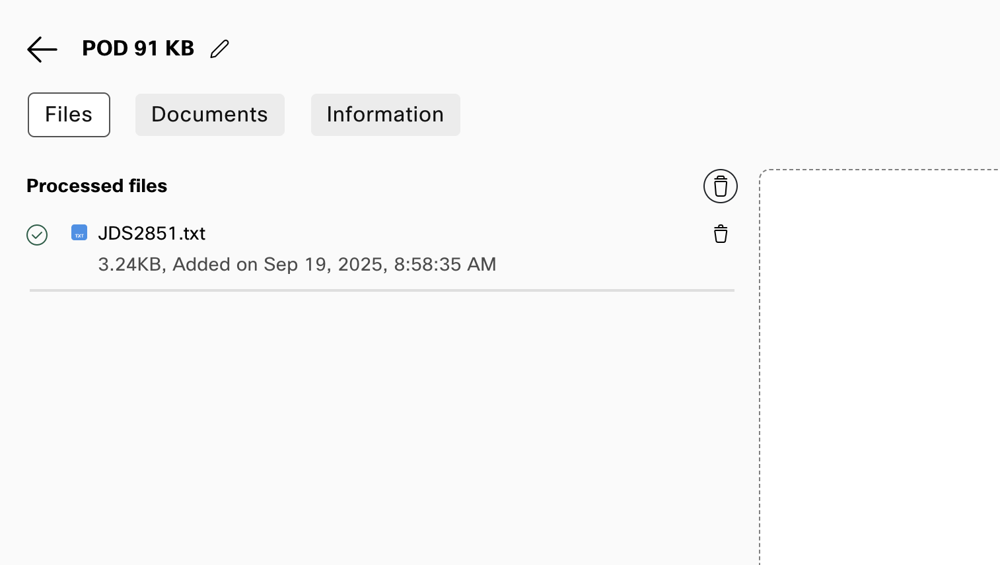

# Webex AI Agent, MCP, and AI Memory :robot:

This lab completes the Webex Sneakers experience. You create an AI Agent that helps callers choose a shoe based on their preferences, then review the resulting customer context and AI Memory in Agent Desktop.

The shared Webex Sneakers MCP service has no access to a POD's JDS data. It provides the current product catalog, so every POD can use the same service safely.

???+ purpose "Lab objectives"
    By the end of this lab, you will:

    * Create a Webex Sneakers AI Agent and attach its knowledge base.
    * Register and provision the shared MCP service as an Agentic App for your organization.
    * Add the catalog action to the agent.
    * Have sneaker-preference conversations with the AI Agent.
    * Review the customer's JDS journey and AI Memory from Agent Desktop.

## Before you begin

You need the following before starting this lab:

* The progressive profile template that you created in Lab 2.
* The **Webex Sneakers MCP API key** shown in the protected POD lookup on the Overview page. Do not add it to the knowledge base, agent instructions, collection, or any lab file.
* Your Lab 3 flow published with a Virtual Agent V2 node that can be updated to use the agent you create here.

## Lab 4.1 Create the Webex Sneakers AI Agent

???+ webex "Create the knowledge base and agent"
    1. In Control Hub, open **Contact Center** and select the **Webex AI Agent** quick link.
    2. Select the notebook icon and click **Create Knowledge Base**.
    3. Name it `PODXX_WebexSneakers_KB`, replacing `XX` with your POD number.
    4. Download [Webex Sneakers knowledge base](./assets/WebexSneakers.txt), upload it on the **Files** tab, and select **Process Files**.

    ???+ info "Knowledge Base with Files Processed"
        <figure markdown>
        
        </figure>

    5. Return to the dashboard, select **Create agent**, **Start from scratch**, and **Autonomous**.
    6. Enter these essential details:

        | Field | Value |
        | --- | --- |
        | Agent name | `PODXX_Lace_WebexSneakers_AI` |
        | AI engine | Select an available Webex AI engine |
        | Agent goal | Help Webex Sneakers customers choose a shoe that fits how and where they plan to wear it. |

    7. Create the agent. Set the welcome message to: `Hi, I'm Lace, your Webex Sneakers concierge. Tell me how you plan to use your next pair, and I'll help you choose a shoe.`
    8. On the **Knowledge** tab, select `PODXX_WebexSneakers_KB`, then select **Save changes**.

## Lab 4.2 Register the shared MCP service

The MCP service is already hosted for the lab. Each POD registers it as an Agentic App so that Webex can discover and govern its catalog tool for that organization.

???+ important "Use a Customer Administrator account"
    The Developer Portal registration and **Apps > Agentic Apps** provisioning must be completed with a Customer Administrator account for the POD. A Partner account does not expose the required organization settings.

???+ webex "Register the Agentic App"
    1. Go to [Webex for Developers](https://developer.webex.com) and sign in with the POD Customer Administrator account.
    2. Select **Start Building Apps**, then **Create an Agentic App**.
    3. Use these values:

        | Field | Value |
        | --- | --- |
        | Agentic App Module | `MCP` |
        | Transport Type | `Streamable HTTP` |
        | Agentic App Name | `PODXX_WebexSneakers_MCP` |
        | Description | Shared lab MCP service for the Webex Sneakers catalog. |
        | Agentic App URL | `https://mcp.cx-tme.com/webex-sneakers/mcp` |
        | Authentication type | `API Key` |

    4. Add the Agentic App. Do not submit it to App Hub; it is only needed in this POD organization.

## Lab 4.3 Provision the Agentic App and enable its tool

???+ webex "Configure the Agentic App in Control Hub"
    1. In [Control Hub](https://admin.webex.com), open **Apps** > **Agentic Apps**, then select `PODXX_WebexSneakers_MCP`.
    2. On the **General** tab, set the app to **Allowed** and save.
    3. On the **Authentication** tab, enter the Webex Sneakers MCP API key from the protected POD lookup and save.
    4. On the **Tools** tab, enable `list_products` and save.

        | Tool | Use in the lab |
        | --- | --- |
        | `list_products` | Lists the five shoes and their available sizes. |

## Lab 4.4 Add the MCP action and agent instructions

???+ webex "Add the available MCP action"
    1. Return to **AI Agent Studio** and open `PODXX_Lace_WebexSneakers_AI`.
    2. Select the **Actions** tab.
    3. Select **Add Actions** > **Select Available**.
    4. Add `list_products`.
    5. Verify that its input schema comes from the MCP service. Do not create a Webex Connect fulfillment flow for this action.
    6. On the **Profile** tab, add the following instructions and then select **Save changes**:

        ```text
        You are Lace, the Webex Sneakers concierge. Keep answers conversational and concise.

        Product discovery
        - Use [list_products] when a customer asks what shoes are available, needs a SKU, or needs sizes.
        - Offer only products and sizes returned by the tool.

        Sneaker preferences
        - Ask how the customer plans to use the shoes, such as daily running, casual daily wear, court-inspired style, light trails, or easy comfort.
        - Recommend one or two models that match the customer's stated preference and explain the relevant features.
        - State that every model costs $130.00.
        - Do not ask for payment, address, email address, or other sensitive information.

        Scope
        - This is a product-advice experience. Do not offer discounts, take orders, or create shipments.
        - For requests outside the catalog experience, offer to transfer to a human agent according to the contact center policy.
        ```

    7. Publish the agent.

## Lab 4.5 Connect the Lab 3 flow to your AI Agent

???+ webex "Replace the placeholder with your AI Agent"
    1. In Control Hub, open **Contact Center** > **Flows** and open the published Lab 3 flow in Flow Designer.
    2. Enable **Edit** mode and remove the **AI Agent Placeholder** Play Message node.
    3. Add a **Virtual Agent V2** node in its place. Connect the output of the JDS event HTTP Request node to the Virtual Agent V2 node.
    4. Set **Contact Center AI Config** to **Webex AI Agent (Autonomous)**.
    5. Select `PODXX_Lace_WebexSneakers_AI` as the Virtual Agent.
    6. Save, validate, and publish the flow.
    7. Confirm that the POD's existing channel still uses this routing flow.

## Lab 4.6 Have sneaker-preference conversations

???+ webex "Browse and call"
    1. Open the [Webex Sneakers storefront](https://cx-tme.com/webex-sneakers/) and review the five displayed shoes.
    2. Call the POD phone number, choose the Virtual Agent option, and describe how you plan to use the shoes. For example, ask for a recommendation for daily running, a light trail, or casual wear.
    3. Ask a follow-up question about the recommended shoe's features, available sizes, or another model.
    4. End the call, then complete a second short conversation with Lace for the same caller. Discuss a different preference or ask for a comparison between two models.

???+ note "Expected result"
    The conversations demonstrate product discovery through the knowledge base and shared MCP catalog. They also create the conversation insights that AI Memory uses.

## Lab 4.7 View AI Memory and the JDS journey

AI Memory does not require configuration in this lab. It becomes useful after you have conversations with the AI Agent and/or a human agent for the same customer.

???+ webex "Review the customer context"
    1. Sign in to Agent Desktop with the POD agent credentials and open the JDS widget.
    2. Search for the customer's phone number or merged identity.
    3. Review the Page Visit events, the profile metric, and the interaction history.
    4. During or after an eligible interaction, inspect the AI Memory content in the JDS widget. It is created from the sneaker-preference conversation insights and may take a short time to appear.

Congratulations! You have completed the Webex Sneakers JDS, MCP, and AI Memory journey.
