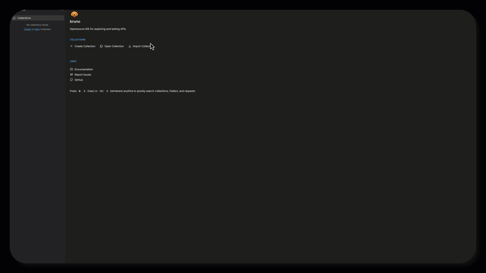

# Overview

## Learning Objectives :open_book:

This lab will give you an introduction to Customer Journey Data Service (CJDS) for Webex Contact Center. Next, you'll access a Webex Contact Center developer sandbox, get hands-on with modifying an IVR flow in the Flow Designer tool, and utilize a Bruno collection to make API calls & send JDS events in the flow. Then, you'll validate the flow by calling the assigned inbound phone number and test the IVR as a customer. After that, you'll explore the Agent Desktop and observe how it all comes together inside of a Widget. 

## Disclaimer

Although the lab design and configuration examples could be used as a reference, for design related questions please contact your representative at Cisco, or a Cisco partner.

## Lab Access :key:

Use the POD number assigned by your instructor to look up your lab tenant details. Enter the lab passcode provided by your instructor to reveal the POD password and the Webex Sneakers MCP API key. Use these values throughout the lab.

???+ webex "Find Your POD Information"
    

      

        

          <label class="pod-lookup__label" for="pod-number">POD Number</label>
          <input id="pod-number" class="pod-lookup__input" type="number" min="1" max="33" inputmode="numeric" placeholder="1-33" aria-describedby="pod-lookup-message">
        

        

          <label class="pod-lookup__label" for="pod-passcode">Lab Passcode</label>
          <input id="pod-passcode" class="pod-lookup__input pod-lookup__input--passcode" type="password" autocomplete="off" placeholder="Passcode">
        

        

          <button id="pod-lookup-button" class="pod-lookup__button" type="button">Show POD Info</button>
        

      

      
Enter your assigned POD number.

      

        <table>
          <tbody>
            <tr><th scope="row">POD Name</th><td><code id="pod-name"></code></td></tr>
            <tr><th scope="row">Org ID</th><td><code id="pod-org-id"></code></td></tr>
            <tr><th scope="row">Admin User</th><td><code id="pod-admin-user"></code></td></tr>
            <tr><th scope="row">Agent User</th><td><code id="pod-agent-user"></code></td></tr>
            <tr><th scope="row">Password</th><td><code id="pod-password"></code></td></tr>
            <tr><th scope="row">Webex Sneakers MCP API Key</th><td><code id="pod-mcp-api-key"></code></td></tr>
            <tr><th scope="row">Control Hub</th><td><a id="pod-control-hub" href="https://admin.webex.com" target="_blank" rel="noopener">https://admin.webex.com</a></td></tr>
            <tr><th scope="row">Agent Desktop</th><td><a id="pod-agent-desktop" href="https://desktop.wxcc-us1.cisco.com" target="_blank" rel="noopener">https://desktop.wxcc-us1.cisco.com</a></td></tr>
          </tbody>
        </table>
      

    

    !!! warning "Use Your Assigned POD"
        Do not use another attendee's POD credentials. The Org ID and users are unique to each POD.

## Getting Started :rocket:

In this section, we’ll prepare the environment needed to complete the lab. Please follow each step carefully to ensure everything is ready for the hands-on exercises. Once the environment is configured, you’ll be ready to dive into the lab activities!

To get started, you’ll need to download the Bruno collection for this lab. This collection contains all the necessary API requests to complete the exercises. Follow these steps:

1. Download the Collection: <a href="https://github.com/WebexCC-SA/LAB-2851/blob/main/docs/assets/Bruno_Wx1_JDS_Collection.json" target="_blank">WebexOne JDS Bruno Collection</a>  - Click on the link to download the Bruno collection file.
2. Import into Bruno:
    - Open Bruno.
    - Go to File > Import.
    - Select the downloaded collection file and import it.

???+ tip "Bruno Import GIF"
    <figure markdown>
    
    </figure>

???+ info "Postman Collection"
    Instructions in this guide were written using Bruno, but you can download the Postman collection here: <a href="https://github.com/WebexCC-SA/LAB-2851/blob/main/docs/assets/Wx1_JDS_Collection.postman_collection.json" target="_blank">WebexOne JDS Postman Collection</a>

Once imported, you’ll be able to access the collection and use it to complete the lab tasks.
